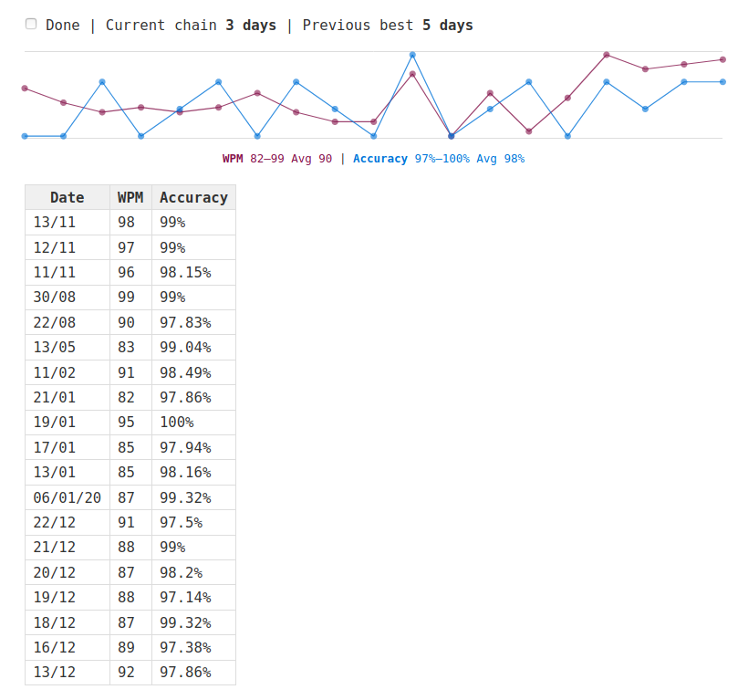

# Sparklines

Tiddlywiki macro to display multiple SVG sparklines from data in markdown table format.

I've developed this macro for my personal tiddlywikis over the last few years and decided to share it here in case anybody might find it useful.

## Basic usage

This is a [tiddlywiki](https://tiddlywiki.com/) macro so it will only work inside a tiddlywiki file. After installation (see below), put the following macro code inside a tiddler where you want to display sparklines:

```
   <<sparkline4 "
   |!Date|!WPM|!Accuracy|
   |13/11|98|99%|
   |12/11|97|99%|
   |11/11|96|98.15%|
   |30/08|99|99%|
   "
   >>
```

Note: _The date column is currently in `dd/mm` format, with the most recent entries at the top_

The macro will display a different coloured sparkline for each column of data. Each of the data points has a `title` attribute which displays the date and value on mouse hover.

In addition to the sparklines the macro will display stats on the longest continuous daily chain (useful for tracking daily goals), and will echo the markdown table. The daily chain info includes a checkbox which sets a tag named `GTDone` on the current tiddler.

Display of these elements can be over-ridden with three boolean parameters: `<hideChainInfo> <hideDataEcho> <hideSparkline>`

The end result is far less minimal than classic Tuftian sparklines!



## Usage with parameters

This example would display just the sparklines:

```
   <<sparkline4 "
   |!Date|!WPM|!Accuracy|
   |13/11|98|99%|
   |12/11|97|99%|
   |11/11|96|98.15%|
   |30/08|99|99%|
   "
   true true false
   >>
```

## Installation

* Create a [tiddlywiki](https://tiddlywiki.com/)
* Create a new tiddler
* Set the __Type__ to `application/javascript`
* Add a field named `module-type` with the value `macro`
* Paste the javascript source into the body of the tiddler
* Save and close the tiddler
* Save and reload the tiddlywiki
* Use the macro to track your daily goals!